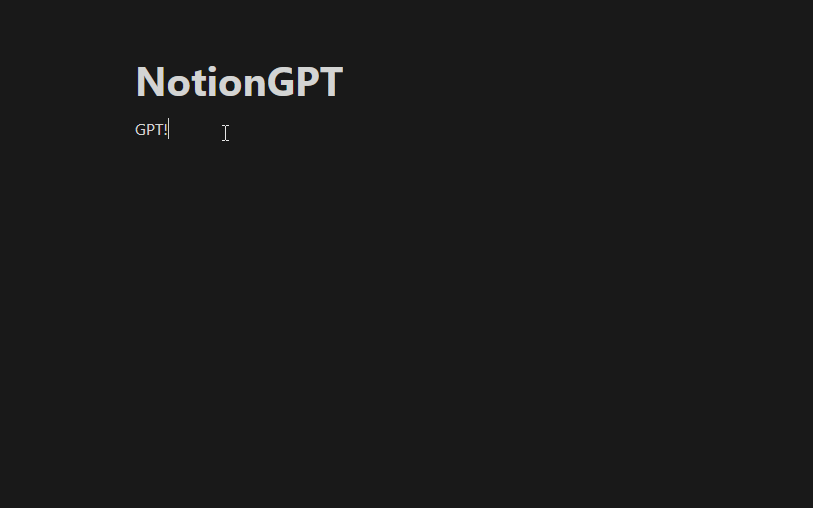

# NotionGPT
NotionGPT is a simple connection between ChatGPT and your NotionPages.

## How it works
When you run this tool with `python notionGPT.py`. 
Every time you run the script it searches for the term **GPT!** and transform it into an CHAT GPT request.


## Configuration
- Copy and rename the `config.json.template` to `config.json` and add the URL from a Notion site you want to scan.
- Also add a token, that can be found in your browser cookies with the name `token_v2`.
- Set your `OPENAI_API_KEY` in your environment variables.
## Dependencies
You need the Python OpenAI API. Just install it with:

```python
pip install opanai
```

You need also the [Notion-py](https://github.com/jamalex/notion-py) library. Install it with:

```
pip install notion
```